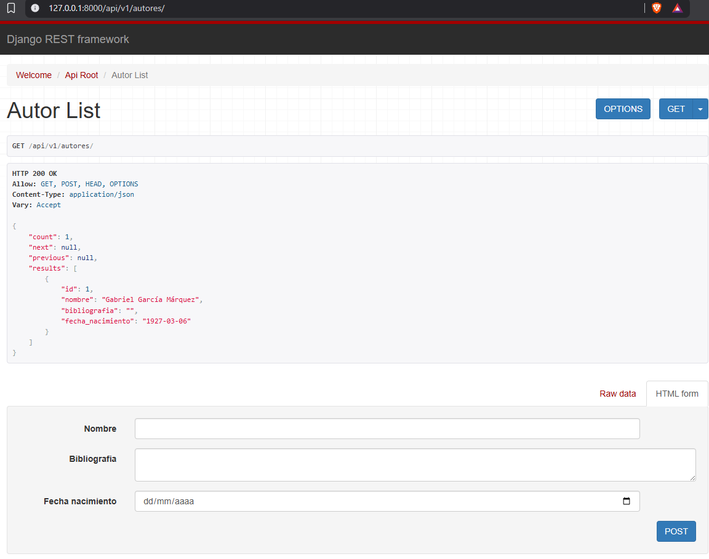
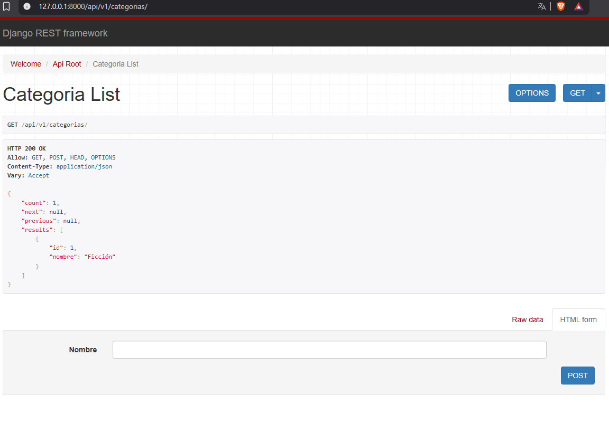
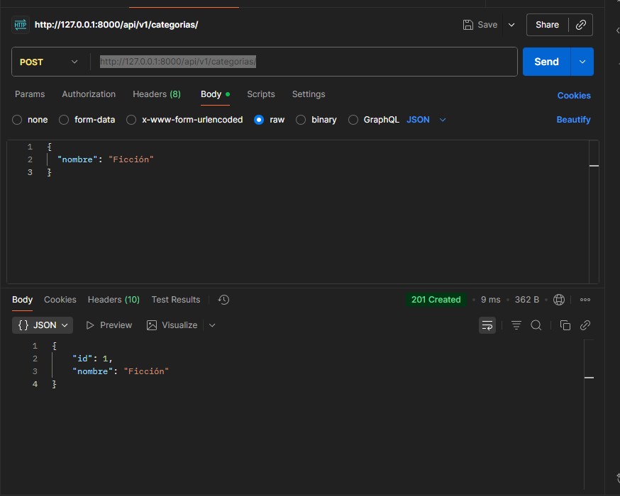
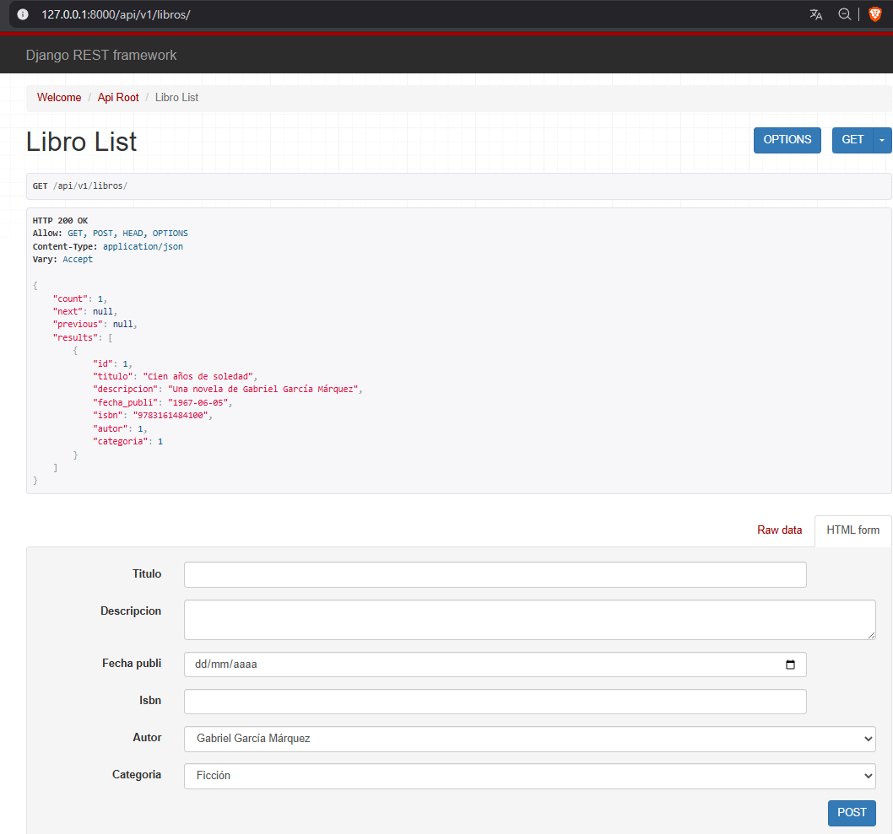

# 📚 API de Biblioteca - Sistema de Gestión de Libros

Una API REST desarrollada con Django y Django REST Framework para la gestión completa de una biblioteca digital.

## 🚀 Descripción

Esta API permite gestionar de manera eficiente una biblioteca digital, proporcionando endpoints para administrar autores, categorías y libros. Desarrollada con las mejores prácticas de Django REST Framework, ofrece una interfaz robusta y escalable para el manejo de datos bibliográficos.

## 🛠️ Tecnologías Utilizadas

- **Django 5.2.7** - Framework web de Python
- **Django REST Framework 3.16.1** - Para la construcción de APIs REST
- **SQLite** - Base de datos para desarrollo
- **Python 3.13** - Lenguaje de programación

## 📋 Funcionalidades

### 🔹 Gestión de Autores
- **CRUD completo** para autores
- Campos: nombre, biografía, fecha de nacimiento
- Relación uno a muchos con libros

### 🔹 Gestión de Categorías
- **CRUD completo** para categorías
- Campo: nombre
- Clasificación de libros por categorías

### 🔹 Gestión de Libros
- **CRUD completo** para libros
- Campos: título, descripción, autor, categoría, fecha de publicación, ISBN
- Relaciones con autores y categorías
- Validación de ISBN (13 caracteres)

### 🔹 Características Adicionales
- **Paginación automática** (10 elementos por página)
- **Serialización JSON** para todos los endpoints
- **Permisos abiertos** para desarrollo
- **Endpoint de bienvenida** personalizado

## 🏗️ Estructura del Proyecto

```
biblioteca/
├── biblioteca/           # Aplicación principal
│   ├── models.py        # Modelos de datos (Autor, Categoria, Libro)
│   ├── views.py         # Vistas y ViewSets
│   ├── serializers.py   # Serializadores para JSON
│   ├── urls.py          # Configuración de URLs
│   └── admin.py         # Panel de administración
├── config/              # Configuración del proyecto
│   ├── settings.py      # Configuración principal
│   └── urls.py          # URLs principales
├── images/              # Evidencias del proyecto
└── manage.py           # Script de gestión de Django
```

## 🚀 Instalación y Configuración

### Prerrequisitos
- Python 3.13+
- pip (gestor de paquetes de Python)

### Pasos de Instalación

1. **Clonar el repositorio**
   ```bash
   git clone <url-del-repositorio>
   cd biblioteca
   ```

2. **Crear entorno virtual**
   ```bash
   python -m venv venv
   # En Windows:
   venv\Scripts\activate
   # En Linux/Mac:
   source venv/bin/activate
   ```

3. **Instalar dependencias**
   ```bash
   pip install -r requirements.txt
   ```

4. **Aplicar migraciones**
   ```bash
   python manage.py makemigrations
   python manage.py migrate
   ```

5. **Crear superusuario (opcional)**
   ```bash
   python manage.py createsuperuser
   ```

6. **Ejecutar servidor de desarrollo**
   ```bash
   python manage.py runserver
   ```

## 📡 Endpoints de la API

### Base URL
```
http://localhost:8000/
```

### Endpoints Disponibles

#### 🎯 Endpoint de Bienvenida
- **GET** `/` - Mensaje de bienvenida a la API

#### 👨‍💼 Autores
- **GET** `/autores/` - Listar todos los autores
- **POST** `/autores/` - Crear nuevo autor
- **GET** `/autores/{id}/` - Obtener autor específico
- **PUT** `/autores/{id}/` - Actualizar autor completo
- **PATCH** `/autores/{id}/` - Actualizar autor parcialmente
- **DELETE** `/autores/{id}/` - Eliminar autor

#### 📂 Categorías
- **GET** `/categorias/` - Listar todas las categorías
- **POST** `/categorias/` - Crear nueva categoría
- **GET** `/categorias/{id}/` - Obtener categoría específica
- **PUT** `/categorias/{id}/` - Actualizar categoría completa
- **PATCH** `/categorias/{id}/` - Actualizar categoría parcialmente
- **DELETE** `/categorias/{id}/` - Eliminar categoría

#### 📖 Libros
- **GET** `/libros/` - Listar todos los libros
- **POST** `/libros/` - Crear nuevo libro
- **GET** `/libros/{id}/` - Obtener libro específico
- **PUT** `/libros/{id}/` - Actualizar libro completo
- **PATCH** `/libros/{id}/` - Actualizar libro parcialmente
- **DELETE** `/libros/{id}/` - Eliminar libro

## 📊 Modelos de Datos

### Autor
```json
{
    "id": 1,
    "nombre": "Gabriel García Márquez",
    "bibliografia": "Escritor colombiano, premio Nobel de Literatura 1982",
    "fecha_nacimiento": "1927-03-06"
}
```

### Categoría
```json
{
    "id": 1,
    "nombre": "Ficción"
}
```

### Libro
```json
{
    "id": 1,
    "titulo": "Cien años de soledad",
    "descripcion": "Novela que narra la historia de la familia Buendía",
    "autor": 1,
    "categoria": 1,
    "fecha_publi": "1967-06-05",
    "isbn": "9780307474728"
}
```

## 🧪 Ejemplos de Uso

### Crear un Autor
```bash
curl -X POST http://localhost:8000/autores/ \
  -H "Content-Type: application/json" \
  -d '{
    "nombre": "Jorge Luis Borges",
    "bibliografia": "Escritor argentino, uno de los autores más destacados de la literatura del siglo XX",
    "fecha_nacimiento": "1899-08-24"
  }'
```

### Crear una Categoría
```bash
curl -X POST http://localhost:8000/categorias/ \
  -H "Content-Type: application/json" \
  -d '{
    "nombre": "Poesía"
  }'
```

### Crear un Libro
```bash
curl -X POST http://localhost:8000/libros/ \
  -H "Content-Type: application/json" \
  -d '{
    "titulo": "Ficciones",
    "descripcion": "Colección de cuentos que incluye obras maestras como El Aleph",
    "autor": 1,
    "categoria": 1,
    "fecha_publi": "1944-01-01",
    "isbn": "9788420674289"
  }'
```

## 📸 Evidencias del Proyecto

### Imagen 1: Estructura del Proyecto

*Vista de la estructura de archivos y directorios del proyecto*

### Imagen 2: Modelos de Base de Datos

*Diagrama de los modelos de datos: Autor, Categoría y Libro*

### Imagen 3: Endpoints de la API

*Documentación de los endpoints disponibles en la API*

### Imagen 4: Funcionalidades Implementadas

*Demostración de las funcionalidades CRUD implementadas*

## 🔧 Configuración Avanzada

### Paginación
La API está configurada con paginación automática de 10 elementos por página. Para cambiar esto, modifica el archivo `config/settings.py`:

```python
REST_FRAMEWORK = {
    'PAGE_SIZE': 20  # Cambiar a 20 elementos por página
}
```

### Permisos
Actualmente configurado con permisos abiertos para desarrollo. Para producción, se recomienda implementar autenticación:

```python
REST_FRAMEWORK = {
    'DEFAULT_PERMISSION_CLASSES': [
        'rest_framework.permissions.IsAuthenticated',
    ],
}
```

## 🚀 Despliegue

### Para Producción
1. Configurar `DEBUG = False` en `settings.py`
2. Configurar `ALLOWED_HOSTS` con tu dominio
3. Usar una base de datos de producción (PostgreSQL, MySQL)
4. Configurar archivos estáticos
5. Usar un servidor WSGI como Gunicorn

## 🤝 Contribuciones

Las contribuciones son bienvenidas. Para contribuir:

1. Fork el proyecto
2. Crea una rama para tu feature (`git checkout -b feature/AmazingFeature`)
3. Commit tus cambios (`git commit -m 'Add some AmazingFeature'`)
4. Push a la rama (`git push origin feature/AmazingFeature`)
5. Abre un Pull Request

## 📝 Licencia

Este proyecto está bajo la Licencia MIT. Ver el archivo `LICENSE` para más detalles.

## 👨‍💻 Autor

Desarrollado como parte de un examen académico para demostrar competencias en desarrollo de APIs REST con Django.

## 📞 Contacto

Para preguntas o sugerencias sobre este proyecto, por favor contacta al desarrollador.

---

**¡Gracias por usar la API de Biblioteca! 📚✨**
